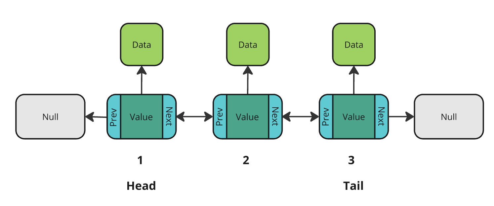

# Doubly Linked List

This repo provides a generalised [Doubly Linked List](https://en.wikipedia.org/wiki/Doubly_linked_list) data structure for storage variables, written in solidity. The data structure is described as generalised because each node in the list contains a value pointer that can be used to reference any stored data types (values, structs, arrays, etc.).

Three specialised contracts are also provided for the typical and expected use-cases of storing addresses, bytes, and uint256s in a doubly linked list. These can be accessed in [extensions](src/extensions).

Note: This implementation has not been audited. Use it with extreme caution in production environments.

## Structure

A doubly linked list is a data structure consisting of nodes, where each node contains:

- A pointer to an arbitrary value (which is the data stored at this node).
- A pointer to the next node in the sequence.
- A pointer to the previous node in the sequence.



Characteristics:

- Efficient Insertions and Deletions: Adding or removing elements takes constant time (O(1)), as only pointers need to be updated.
- Inefficient Reads: Sequential traversal is required to locate elements unless additional pointers or indexing mechanisms are implemented.

This structure is ideal for use cases like queues, stacks, or scenarios requiring a list with insertion and deletion functionality.

## Installation

[Foundry](https://getfoundry.sh/) install:
```bash
forge install 0xCooki/Doubly-Linked-List
```

## Usage

To use the specialised contracts that store a known value type, such as `bytes` as below, simply inport and inherit the contract. Now the doubly linked list of bytes can be accessed and manipulated via the inherited contract and it's functions. Note that there are no access controls placed on any functions in these specialised contracts by default. 

```bash
pragma solidity ^0.8.8;

import {DoublyLinkedListBytes} from "Doubly-Linked-List/src/extensions/DoublyLinkedListBytes.sol";

contract NameRegistry is DoublyLinkedListBytes {
    constructor() {
        addValueAtPosition(0, "Cooki");
    }
}
```

For those looking to use a unique data type in their list, such as the `ScoreCard` struct below, they will need to implement their own storage variables and mapping functionality to connect the value pointers in the list to the stored data.

```bash
pragma solidity ^0.8.8;

import {ptr, createPointer, DLL, NodeLib, Node, NULL_PTR, DoublyLinkedListLib} from "Doubly-Linked-List/src/DoublyLinkedList.sol";

struct ScoreCard {
    string name;
    uint256 score;
    bool usedBoost;
}

contract ScoreBoard {
    using NodeLib for Node;
    using DoublyLinkedListLib for DLL;

    mapping(ptr => ScoreCard) public cards;

    DLL public board;

    uint64 private counter;

    constructor() {
        board.push(_createPtrForScoreCard(ScoreCard("Simon", 21, false)));
        board.push(_createPtrForScoreCard(ScoreCard("James", 77, true)));
        board.push(_createPtrForScoreCard(ScoreCard("Emily", 58, false)));
    }

    function _createPtrForScoreCard(ScoreCard memory _card) private returns (ptr newPtr) {
        newPtr = createPointer(++counter);
        cards[newPtr] = _card;
    }

    # Always keep in mind that the pointer to the node does not equal the value pointer in the node
    function valueAtNode(ptr _ptr) external view returns (ScoreCard memory) {
        ptr valuePtr = board.valueAt(_ptr);
        return cards[valuePtr];
    }
}
```
More example implementations can be accessed in [examples](src/extensions).

## Development

[Foundry](https://getfoundry.sh/) repo install guide:

```bash
# Clone the repo and enter
git clone git@github.com:0xCooki/Doubly-Linked-List.git && cd Doubly-Linked-List
# Install deps.
forge install
# Build
forge build
# Run tests
forge test
```

## Credits

This repo is heavily inspired by Merklejerk's [memory-linked-list](https://github.com/merklejerk/memory-linked-list/tree/main) repo.
